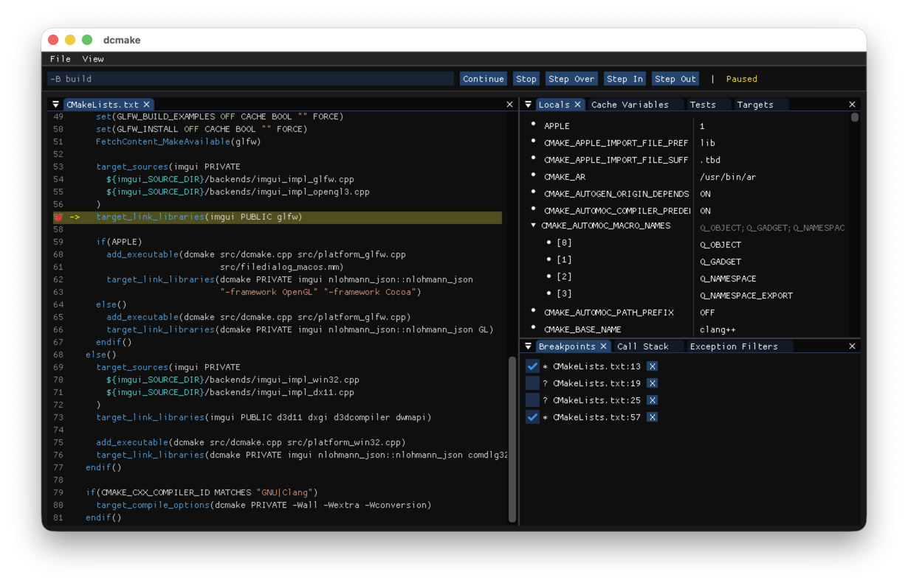

# dcmake: CMake debugger front-end

An ImGui front end for [`cmake --debugger`][doc] communicating with
[DAP][]. It allows stepping through and inspecting a CMake build. Supports
at least Windows, macOS, and Linux.

## Build

On any platform:

    $ cmake -B build
    $ cmake --build build

On Linux you may need to install `xorg-dev` or similar first.

## Usage

    $ dcmake [cmake args..]

Where any arguments become CMake arguments in the debugger. The
command line is editable from the UI and supports shell variable
expansion (`$VAR` on Unix, `%VAR%` on Windows).

## Shortcuts

| Key | Action |
|-----|--------|
| F5 | Start (free-running) / Continue |
| Shift+F5 | Stop |
| F10 | Start (break at first line) / Step Over |
| F11 | Start (break at first line) / Step In |
| Shift+F11 | Step Out |

## Configuration

Layout and window state are saved to `imgui.ini` in a platform config
directory:

| Platform | Path |
|----------|------|
| Linux/macOS | `$XDG_CONFIG_HOME/dcmake/` or `~/.config/dcmake/` |
| Windows | `%AppData%\dcmake\` |

[DAP]: https://microsoft.github.io/debug-adapter-protocol/
[doc]: https://cmake.org/cmake/help/latest/manual/cmake.1.html#cmdoption-cmake-debugger
